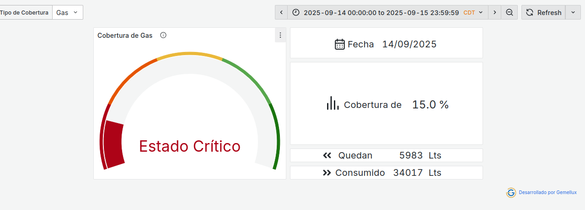

# Dashboards de Monitoreo - Hotel Nacional de Cuba

Sistema de visualización de consumos energéticos para el [Hotel Nacional de Cuba](https://elhotelnacionaldecuba.com/). Monitorea en tiempo real el consumo de electricidad, agua, gas y diesel, con alertas de cobertura.

> [!note] 
> _Este proyecto no posee información sensible ni expone el funcionamiento interno de la institución, solo posee la visualización y diseños sugeridos con consultas a una database mockeada_

## Dashboards

### 1. Dashboard de Cobertura

- Estado de combustibles (Diesel, Gas, Agua)
- Indicadores visuales por colores
- Medidor de porcentaje y valores reales

### 2. Dashboard de Consumo

- Monitoreo por tipo de energía
- Períodos: Diario, Mensual, Anual
- Comparativa: Real vs Planificado vs Año Anterior

### 3. Consumo por HDO

- Consumo eléctrico por habitación ocupada
- Análisis de eficiencia energética

## Tecnologías

- **Grafana** - Visualización
- **PostgreSQL** - Base de datos
- **JSON** - Configuración dashboards

## Instalación

> Explicación detallada en [este documento](./docs/Importación_en_grafana.md)

1. Importar JSONs en Grafana o definir la carpeta `grafana/` como Provisioning
2. Configurar datasource PostgreSQL

---

_Sistema desarrollado para la gestión eficiente de recursos del Hotel Nacional de Cuba_
