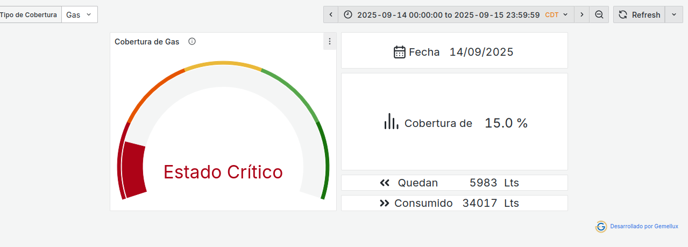
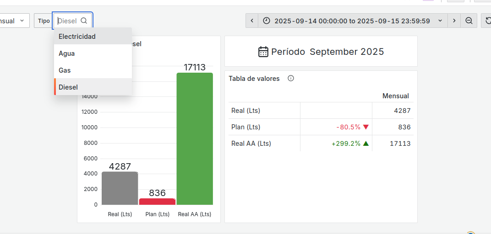
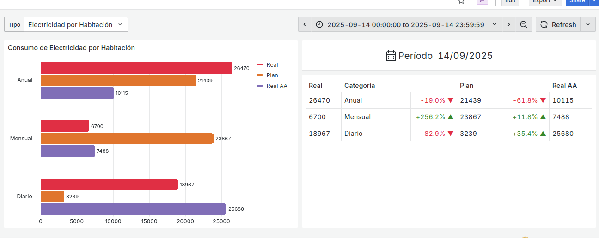

# Dashboards de Monitoreo - Hotel Nacional de Cuba


Sistema de visualización de consumos energéticos para el [Hotel Nacional de Cuba](https://elhotelnacionaldecuba.com/). Monitorea en tiempo real el consumo de electricidad, agua, gas y diesel, con alertas de cobertura.

> [!note]
> _Este proyecto no posee información sensible ni expone el funcionamiento interno de la institución, solo posee la visualización y diseños sugeridos con consultas a una database mockeada_

## Dashboards

### 1. Dashboard de Cobertura

- Estado de combustibles (Diesel, Gas, Agua)
- Indicadores visuales por colores
- Medidor de porcentaje y valores reales



### 2. Dashboard de Consumo

- Monitoreo por tipo de energía
- Períodos: Diario, Mensual, Anual
- Comparativa: Real vs Planificado vs Año Anterior



### 3. Consumo por HDO

- Consumo eléctrico por habitación ocupada
- Análisis de eficiencia energética



## Tecnologías

- **Grafana** - Visualización
- **PostgreSQL** - Base de datos
- **JSON** - Configuración dashboards

## Instalación y Uso

Este repositorio está configurado para desplegarse automáticamente mediante **Grafana Provisioning**. No es necesario importar los JSONs manualmente desde la UI.

### Docker Compose

Puedes levantar el entorno montando la carpeta `provisioning/` directamente en el contenedor de Grafana:

```yaml
services:
  postgres:
    image: postgres:latest
    environment:
      POSTGRES_USER: gemellux
      POSTGRES_PASSWORD: gemellux
      POSTGRES_DB: gemelluxdb
    ports:
      - "5432:5432"
    volumes:
      - postgres_data:/var/lib/postgresql/data

  grafana:
    image: grafana/grafana:latest
    ports:
      - "3000:3000"
    environment:
      GF_SECURITY_ADMIN_USER: admin
      GF_SECURITY_ADMIN_PASSWORD: admin
    volumes:
      # Monta la carpeta de provisioning/ local en el contenedor
      - ./provisioning:/etc/grafana/provisioning

volumes:
  postgres_data:
```

### Configuración del Datasource

El archivo `provisioning/datasources/default.yml` ya incluye la configuración para el datasource de PostgreSQL (`grafana-postgresql-datasource`).

> [!important]
> Asegúrate de que tu instancia de PostgreSQL tenga cargada la base de datos con la tabla `gemelluxiot.x002fconsumptionobserved` para que las consultas SQL de los dashboards funcionen correctamente.

---

_Sistema desarrollado para la gestión eficiente de recursos del Hotel Nacional de Cuba_
