# Importación de Dashboards en Grafana para el Hotel Nacional 

**Fecha:** 2026-01-11  
**Autor:** Rodny R. Estrada León

### 1. Introducción

Los archivos JSON son archivos de texto que almacenan información estructurada, como configuraciones. En Grafana, se utilizan para exportar o importar dashboards completos, incluyendo sus gráficos, paneles y configuraciones. Esto permite replicar dashboards de manera rápida y consistente entre diferentes instancias de Grafana sin necesidad de reconstruirlos manualmente.

### 2. Requisitos Previos

- **Acceso a la instancia de Grafana:** Credenciales de usuario (nombre de usuario y contraseña) para iniciar sesión en la URL de Grafana (ejemplo: `https://sigure.ejemplo.hotelnacional.cu` o `https://10.43.32.5:3000`).
- **Permisos adecuados:** Su usuario debe tener permisos para crear o importar dashboards (rol de "Editor" o "Administrador").
- **Archivos JSON disponibles:** Los tres archivos JSON de dashboards deben estar descargados y accesibles en su computadora (por ejemplo, en la carpeta "Descargas").

---

### 3. Paso a Paso

Repita el proceso para los tres dashboards.

#### Paso 1: Acceder a Grafana

1. Abra su navegador web (Chrome, Firefox, etc.).
2. Ingrese la dirección URL de su instancia de Grafana descrita anteriormente
3. Inicie sesión con sus credenciales.

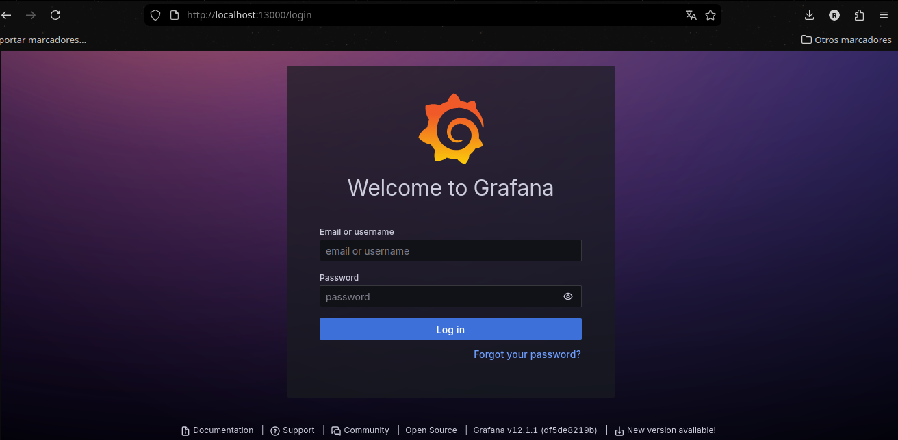

#### Paso 2: Navegar a la Opción de Importación

1. En el menú principal de Grafana (ubicado en el lado izquierdo), haga clic en el icono de **"Dashboards"** (símbolo de cuatro cuadrados).

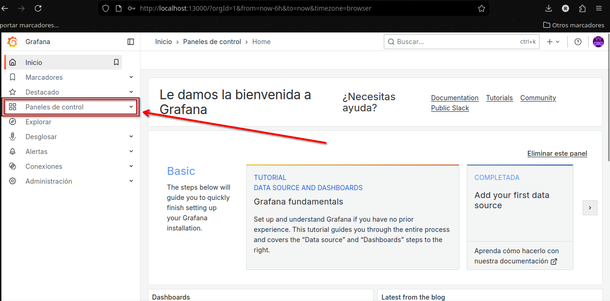

2. Haga click en el botón **New** y en el submenú que aparece, seleccione **"Import"** (tercera opción).

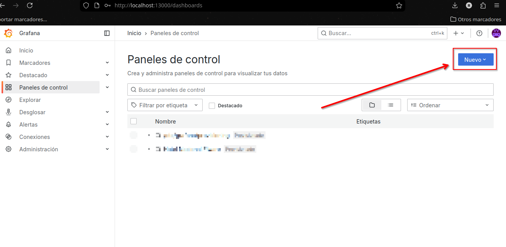

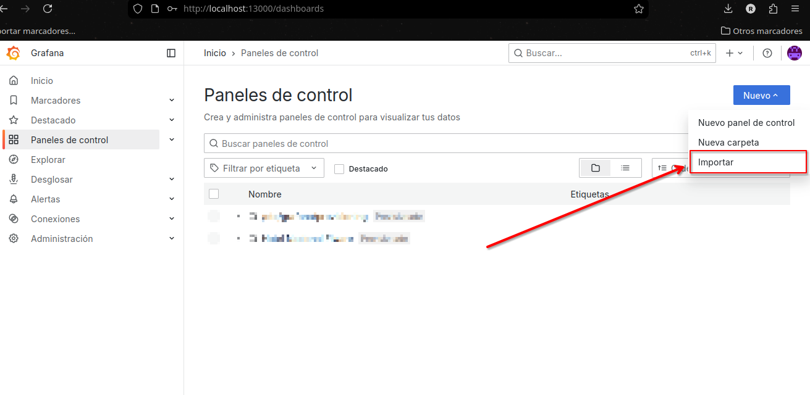

#### Paso 3: Cargar el Archivo JSON

1. Haga clic en el botón **"Upload JSON file"**.

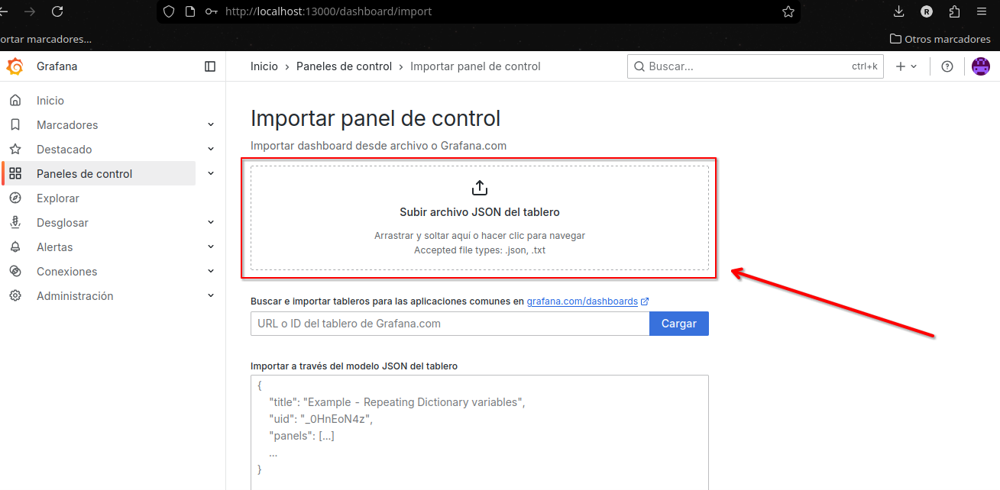

2. Busque y seleccione el primer archivo JSON desde su computadora (por ejemplo, `dashboard_cobertura.json`).

3. Haga clic en **"Open"** o **"Abrir"** para cargarlo.

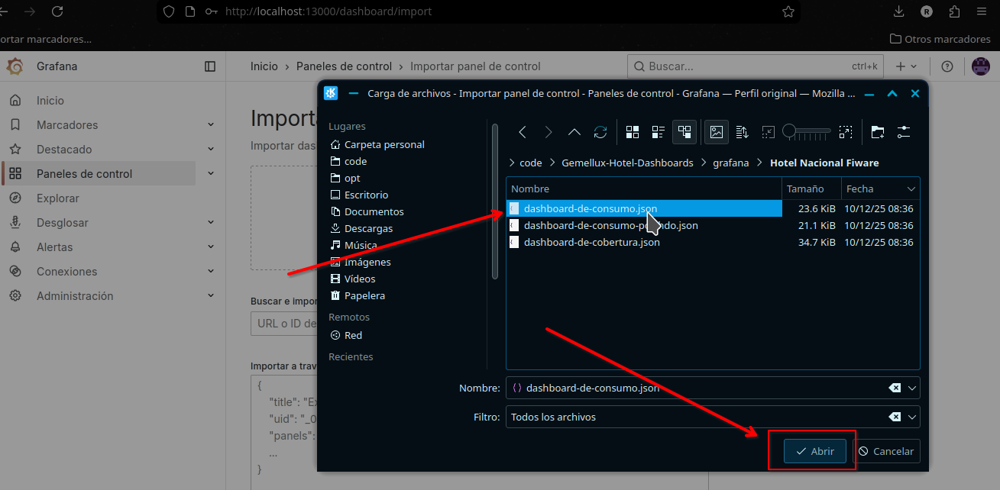

#### Paso 4: Configurar la Importación

1. **Nombre del Dashboard:** Verifique que el nombre propuesto sea adecuado. Puede editarlo si lo desea.
2. **Carpeta:** Seleccione la carpeta donde se guardará (ejemplo: "General" o "Dashboards").
3. **Fuente de Datos (DataSource):** **IMPORTANTE:** Asegúrese de seleccionar la fuente correspondiente en su instancia desde el menú desplegable. Si no existe, puede configurarla después (ver Sección 5).
4. Haga clic en el botón **"Import"** (color azul).

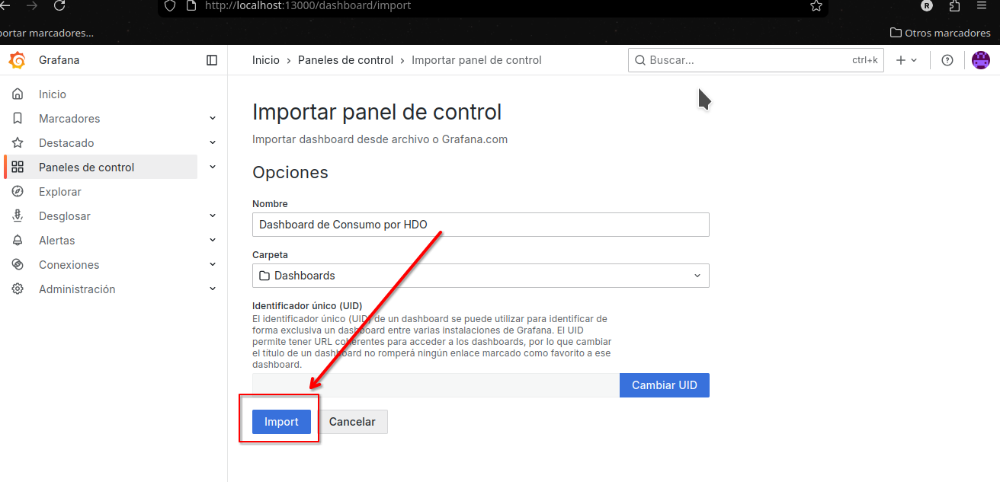

**Descripción visual:** Al completar la importación, será redirigido automáticamente al dashboard recién importado.

#### Paso 5: Confirmar Importación Exitosa

1. Verifique que el dashboard se muestre con todos sus gráficos y paneles.
2. En la parte superior, confirme que el nombre del dashboard coincida con el esperado.
3. Repita los Pasos 2 a 5 para los dos archivos JSON restantes.
4. Listo!

---

### 4. Verificación Post-Importación

Una vez importados los tres dashboards, se deben de realizar las siguientes verificaciones:

#### 4.1. Confirmar Visibilidad

Verifique que los tres dashboards aparezcan en la lista

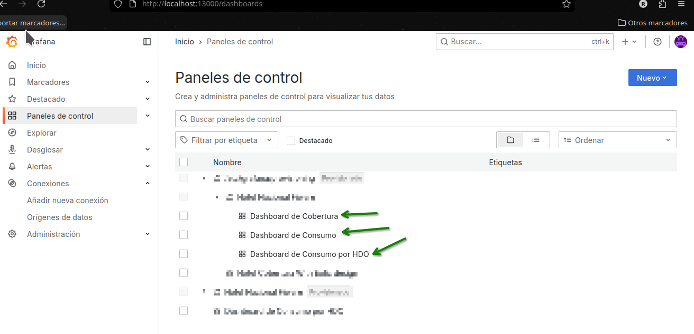

#### 4.2. Verificar Visualizaciones

1. Abra cada dashboard haciendo clic en su nombre.
2. Revise que los gráficos muestren datos (pueden aparecer como vacíos si no hay datos recientes, pero no deben mostrar errores en rojo).

#### 4.3. Manejo de Errores de Fuentes de Datos

- Si algún panel muestra un mensaje como _"Data source not found"_ o _"No data"_, significa que la fuente de datos no está configurada.

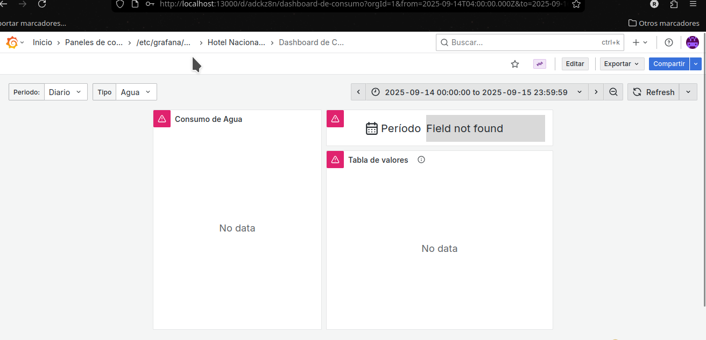

- **Solución rápida:** Edite el panel (haga clic en el título > "Edit") y en la pestaña "Query", seleccione la fuente de datos correcta desde el menú desplegable. Guarde los cambios.

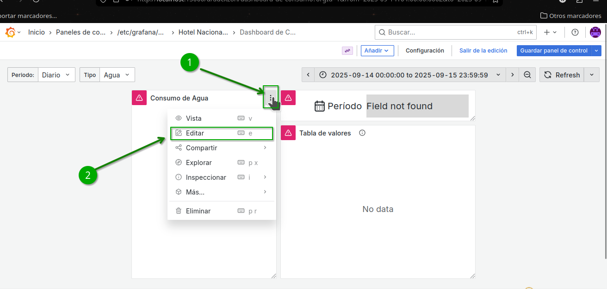
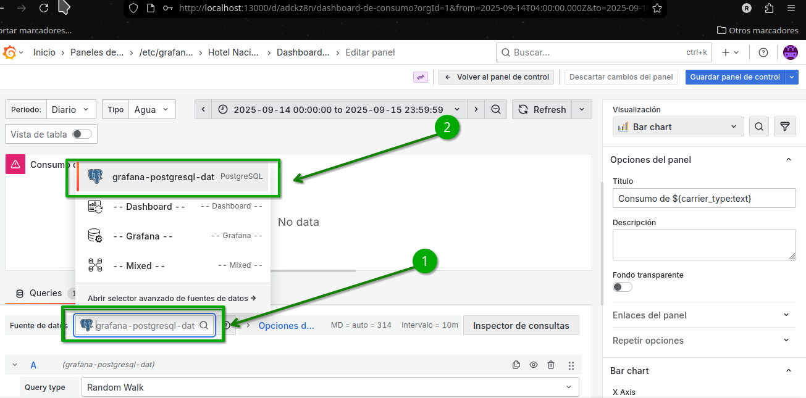

---

### 5. Solución de Problemas Comunes

#### Escenario 1: Error de Permisos Insuficientes

- **Síntoma:** Al intentar importar, aparece el mensaje _"Permission denied"_ o no ve la opción "Import".
- **Solución:** Contacte al administrador de Grafana para que asigne los permisos necesarios (rol "Editor" o superior).

#### Escenario 2: Conflicto de Nombres de Dashboard

- **Síntoma:** Grafana muestra una advertencia: _"A dashboard with the same name already exists"_.
- **Solución:** Durante la importación, cambie el nombre del dashboard (ejemplo: agregue "-v2" al final) o seleccione la opción **"Overwrite"** si desea reemplazar el existente.

#### Escenario 3: Fuentes de Datos No Configuradas

- **Síntoma:** Los paneles muestran _"No data"_ o errores de conexión.
- **Solución:**
  1. Verifique que la fuente de datos esté configurada en Grafana (menú principal > "Configuration" > "Data sources").
  2. Si no existe, agregue la fuente de datos requerida
  3. En el dashboard, actualice cada panel para usar la nueva fuente (ver Sección 4.3).

---

### **6. Asistencia Adicional**

- **Email del autor**: rrodnyestrada1@gmail.com
- **Documentación Oficial de Grafana:** [https://grafana.com/docs/grafana/latest/dashboards/](https://grafana.com/docs/grafana/latest/dashboards/)
